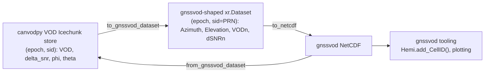

# canvod-adapters

Bidirectional data adapters between canvodpy and third-party GNSS-VOD tools.

`canvod-adapters` converts canvodpy's native data structures into the
shapes expected by other tools in the GNSS-Transmissometry/VOD field, and
back — so each tool's ecosystem can be used on the other's output. Every
conversion records its provenance (source tool, URL, version, direction,
timestamp) in the output dataset's global attributes.

## gnssvod adapter

canvodpy stores computed VOD per analysis pair as one Icechunk group with
`(epoch, sid)`-dimensioned variables `VOD`, `delta_snr`, `phi`, `theta`
(SID format `"G01|L1|C"`). [gnssvod](https://github.com/vincenthumphrey/gnssvod)
(Humphrey et al. — the reference implementation that established this
field) expects `(Epoch, SV)`-dimensioned datasets with per-band columns
like `S1C`/`Azimuth`/`Elevation`/`VOD1`, consumed directly by its own
`Hemi.add_CellID()`, plotting, and hemispheric-statistics tooling.



```python
from canvod.adapters.gnssvod.convert import to_gnssvod_dataset, from_gnssvod_dataset

# canvodpy VOD dataset -> gnssvod-shaped dataset
gnssvod_ds = to_gnssvod_dataset(vod_ds)
gnssvod_ds.to_netcdf("canopy_01_vs_reference_01.nc")

# gnssvod-shaped dataset -> canvodpy VOD dataset
vod_ds = from_gnssvod_dataset(gnssvod_ds)
```

With the optional `store` extra, convenience functions read/write an
Icechunk VOD store directly (accepting a `MyIcechunkStore`, a site/manager
object exposing `.vod_store`, or a filesystem path):

```python
from canvod.adapters.gnssvod.io import vod_store_to_gnssvod_nc, gnssvod_nc_to_vod_store

vod_store_to_gnssvod_nc(site, "canopy_01_vs_reference_01", "out.nc")
gnssvod_nc_to_vod_store("gnssvod_output.nc", site, "imported_analysis")
```

### Known lossy direction

gnssvod merges multiple tracking codes per band via `fillna` before it
ever exports a `VOD1`/`VOD2` column, so the per-code identity is lost by
the time a NetCDF export exists. Converting gnssvod → canvodpy therefore
can't recover the original observed tracking code — reconstructed SIDs use
the band map's declared primary code as a placeholder. Datasets produced
this way carry `attrs["vod_reconstructed_code_ambiguous"] = True` so this
is never silent.

### Band configuration

`BAND_MAP` (default) and `detect_band_map()` (auto-detection from the
input datasets) both live in `canvod.adapters.gnssvod.convert` — pass a
custom `band_map` to either conversion function to override which
tracking code represents each band.

## Origin

This adapter's core logic was originally written for `canvod-audit`'s
Tier-3 comparison against gnssvod (`audit_vs_gnssvod`) in the main
canvodpy monorepo, then extracted here so it's reusable outside the audit
suite. `canvod-audit` now depends on `canvod-adapters` instead of
vendoring its own copy.

## Installation

```bash
uv add "canvod-adapters @ git+https://github.com/nfb2021/canvodpy-extensions.git@v0.1.0#subdirectory=packages/canvod-adapters"
uv add "canvod-adapters[store] @ git+https://github.com/nfb2021/canvodpy-extensions.git@v0.1.0#subdirectory=packages/canvod-adapters"
```

See the [API Reference](../../api/canvod-adapters.md) for the full public API.
