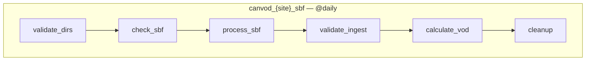
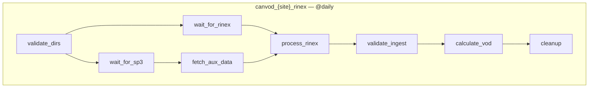
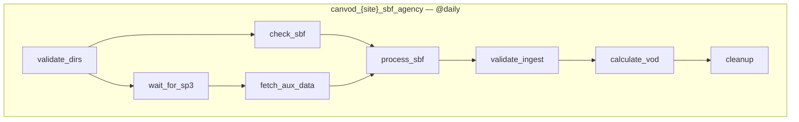

# canvod-airflow

Airflow DAG definitions for canvodpy GNSS-T pipelines.

`canvod-airflow` wraps canvodpy's stateless task functions
(`canvodpy.workflows.tasks`) into Airflow TaskFlow DAGs, generated
dynamically — one set per site configured in canvodpy's `sites.yaml`. No
pipeline logic lives in this package: every task is a thin call into
`canvodpy.workflows.tasks`, which stays in the core `canvodpy` package and
has no Airflow dependency of its own.

## DAGs







| DAG | Ephemeris | Data availability | Chain |
|---|---|---|---|
| `canvod_{site}_sbf` | Broadcast (embedded in SBF) | Same-day | `validate_dirs → check_sbf → process_sbf → validate_ingest → calculate_vod → cleanup` |
| `canvod_{site}_rinex` | Agency SP3/CLK (final products) | ~12-18 day lag | `validate_dirs → {wait_for_rinex, wait_for_sp3} → fetch_aux_data → process_rinex → validate_ingest → calculate_vod → cleanup` |
| `canvod_{site}_sbf_agency` | Agency SP3/CLK, SBF observables | ~12-18 day lag | `validate_dirs → {check_sbf, wait_for_sp3} → fetch_aux_data → process_sbf → validate_ingest → calculate_vod → cleanup` |
| `canvod_backfill` | Whichever branch is selected at trigger time | Manual | `resolve_dates → process_day` (dynamically mapped, one task per date in the range) |

Choose `sbf` for the fastest same-day results at broadcast-ephemeris
precision, `rinex`/`sbf_agency` for the highest geometric quality once
agency orbit/clock products are published.

## Retry-driven scheduling

`wait_for_rinex` and `wait_for_sp3` are sensors (`mode="reschedule"`,
6-hour poke interval, 21-day timeout) — they wait for RINEX files and
SP3/CLK products to become available rather than failing outright. This
handles the natural lag between same-day SBF data and delayed agency
products without any manual re-triggering.

## Concurrency safety

Icechunk stores require serialized commits per branch. Every task that
writes to the store (`calculate_vod`, `process_sbf`, `process_rinex`, and
backfill's `process_day`) uses a shared `canvod_store_write` pool with one
slot, serializing writes across all DAGs and backfill runs simultaneously.
Create the pool once:

```bash
airflow pools set canvod_store_write 1 "Serialise Icechunk commits"
```

Backfill additionally sets `max_active_tis_per_dagrun=1` on its dynamically
mapped `process_day` task, so dates within a single backfill run process
one at a time.

## Manual backfill

`canvod_backfill` reprocesses a historical date range for one site and
branch. Each date becomes an independent mapped task instance — a failure
on one date retries only that date, the rest of the batch continues.

```bash
airflow dags trigger canvod_backfill --conf '{
    "site": "Rosalia",
    "branch": "sbf",
    "start_date": "2025-001",
    "end_date": "2025-010"
}'
```

`branch` selects which ephemeris/reader combination to use for the range:
`sbf` (broadcast, same-day), `rinex` (agency SP3/CLK), or `sbf_agency`
(SBF observables + agency geometry).

## Task functions

All tasks call into `canvodpy.workflows.tasks`, which accepts only
primitives (`str`, `dict`, `list`, `None`) and returns JSON-serializable
dicts suitable for Airflow XCom:

```python
from canvodpy.workflows.tasks import (
    validate_data_dirs,
    check_sbf,
    check_rinex,
    check_sp3_availability,
    fetch_aux_data,
    process_sbf,
    process_rinex,
    validate_ingest,
    calculate_vod,
    cleanup,
)
```

These functions have no Airflow dependency of their own — use them
directly for scripting or debugging without running Airflow at all.

## Installation

```bash
uv add "canvod-airflow[airflow] @ git+https://github.com/nfb2021/canvodpy-extensions.git#subdirectory=packages/canvod-airflow"
```

`apache-airflow` is an optional extra, not a hard dependency — install it
alongside whatever Airflow version your deployment environment provides.

## Deployment

Point your Airflow `dags_folder` at a shim module that imports both DAG
modules (the words "airflow" and "dag" must appear in the shim file for
Airflow's DagBag keyword pre-filter):

```python
# <dags_folder>/canvod_dags.py
from canvod.airflow.daily_processing import *  # noqa: F403  (airflow dag)
from canvod.airflow.backfill import *  # noqa: F403
```

Ensure `canvodpy`'s config (`canvod-settings.yaml`) is accessible from the
Airflow worker — DAGs are generated per configured site at parse time via
`canvod.config.load_config()`.

See the [API Reference](../../api/canvod-airflow.md) for the full public API.
