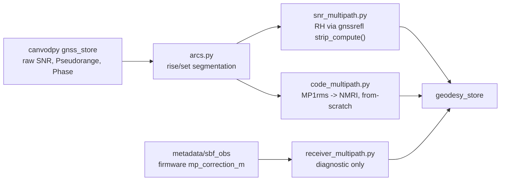

# canvod-gnssgeodesy

Native GNSS geodetic products for canvodpy: reflectometry (reflector
height), code/pseudorange multipath (NMRI), and firmware-reported
multipath diagnostics — with tropospheric products and PPP planned.

!!! warning "Pre-implementation scaffold"
    The package structure, configuration models, and the thin wrapper
    layers around [gnssrefl](https://github.com/kristinemlarson/gnssrefl)
    exist and are tested. The actual retrieval algorithms — arc
    segmentation, the MP1/NMRI pipeline, the reflector-height pipeline,
    and all `geodesy_store` I/O — are not implemented yet and raise
    `NotImplementedError` with a phase reference. See
    [Status](#status) below before relying on any product output.

## License: GPL-3.0-only

Unlike this monorepo's Apache-2.0 default, `canvod-gnssgeodesy` is
**GPL-3.0-only**. It calls gnssrefl's (GPLv3) reflector-height and
refraction-correction functions directly rather than reimplementing
them — gnssrefl is the community-trusted reference implementation for
GNSS interferometric reflectometry (GNSS-IR), and should be called, not
silently re-derived. Because this package depends on and directly calls
GPL-3.0-only code, the combined work is GPL-3.0-only, matching
gnssrefl's own declared license exactly (not `GPL-3.0-or-later`). Do not
depend on this package from an Apache-2.0-licensed package in this
monorepo without checking the license implications first.

**Credit:** the reflector-height retrieval and atmospheric refraction
correction in this package are thin translation layers around
[gnssrefl](https://github.com/kristinemlarson/gnssrefl) by Kristine M.
Larson and collaborators — no GNSS-IR geodesy is re-derived here.
Code/pseudorange multipath (MP1rms, NMRI) has no equivalent Python core
to wrap anywhere upstream (gnssrefl's own MP1 path shells out to the
deprecated `teqc` binary) and is implemented from the published
literature instead (Larson & Small, 2014; Small, Larson & Smith, 2014).

## Scope

| Module | Family | Product | Status |
|---|---|---|---|
| `snr_multipath` | Reflectometry (GNSS-IR proper) | Reflector height (RH) | Wrapper layer complete; retrieval pipeline not yet implemented |
| `code_multipath` | Code/pseudorange multipath | MP1rms, NMRI | Calibration registry complete; retrieval pipeline not yet implemented |
| `receiver_multipath` | Code/pseudorange multipath, firmware-reported | SBF firmware multipath diagnostic | Not yet implemented |
| `tropospheric` | Tropospheric / mapping-function modeling | ZHD/ZWD, mapping functions | Planned |
| `ppp` | Precise point positioning | PPP position/trajectory | Not yet scoped — wrapped tool choice pending |

Position estimation is deliberately **out of scope**: reflector height
and MP1/NMRI both use a station's already-known surveyed coordinate,
and nothing in this package's pipeline consumes a computed position.

## The governing principle: wrap, don't reimplement

gnssrefl is treated as a community-trusted reference implementation.
Its correctness-sensitive computational cores — the Lomb-Scargle
peak-pick behind reflector height, and the refraction/mapping-function
correction applied to elevation angles — are called **directly**,
never reimplemented, wherever a clean in-memory function exists to
wrap. Textbook, non-proprietary surrounding logic (detrending, arc
segmentation, daily aggregation) stays canvod-native.

Code/pseudorange multipath is the one exception, forced by absence, not
choice: gnssrefl's own MP1 path shells out to the deprecated `teqc`
binary, so there is no Python core to wrap, and it is implemented
from scratch, sourced directly from the literature.



## Reflector height (RH)

Reflector height retrieval follows gnssrefl's own method: SNR is
converted to linear amplitude, detrended against elevation over a
configurable window, then handed to gnssrefl's `strip_compute()`
(`gps.py`) for the Lomb-Scargle periodogram and peak-pick — the one
step that is genuine, correctness-sensitive geodesy, and is never
reimplemented. Noise-floor and peak-to-noise evaluation happen on top
of the returned periodogram, canvod-native, since gnssrefl has no
station-agnostic default for the noise region.

### Atmospheric refraction

Elevation angles are corrected for atmospheric refraction before
detrending, again by wrapping gnssrefl's `refraction.py` directly —
a one-time-downloaded static 1°×1° grid (an older GPT2w-generation
model) evaluated with a built-in annual/semiannual harmonic, not a
live NWM-driven model. Four correction methods are exposed, following
gnssrefl's own numbered `refr_model` values:

| Method | Time-varying? | Reference |
|---|---|---|
| Bennett | static or time-varying | Bennett (1982) |
| Ulich | static or time-varying | Ulich (1981) |
| NITE | always time-varying | Peng et al. (2023) |
| MPF | always time-varying | Williams & Nievinski (2017); Strandberg et al. (2020) |

## Code/pseudorange multipath and NMRI

`MP1` combines dual-frequency pseudorange and carrier-phase
observables into a multipath estimate whose only physical dependency
is `alpha = f1² / f2²` — the formula itself is constellation-generic.
What is **not** generic is the literature calibration built on top of
it (elevation mask, baseline fraction): these are registered per
band-pair, GPS L1/L2 only in v1, via an `AlphaCalibration` registry —
adding a future Galileo or BeiDou pair is a registry entry, not a code
change.

Daily `MP1rms` is normalized into the **Normalized Microwave
Reflection Index (NMRI)**:

$$
\text{NMRI} = \frac{\text{MP1max} - \text{MP1rms}}{\text{MP1max}}
$$

following Small, Larson & Smith (2014): *"NMRI is calculated by
normalizing the daily MP1rms values using the average of the highest
5% individual MP1rms values ... The highest 5% of observations
provides a representative value for times when there is a minimum
amount of vegetation."* `NMRI` runs negative on the driest days that
define `MP1max` itself — an expected property of the normalization,
not a defect.

### The `MP1max` baseline: a two-tier policy

Larson & Small's own literature definition takes the top 5% of
`MP1rms` across a fixed, already-collected multi-year archive — it
does not, on its own, say how a **new, continuously-updating** station
should behave before that much history exists. `canvod-gnssgeodesy`
resolves this with a two-tier policy:

- **Tier 1** (record shorter than `climatology_min_years`, default
  `2`): `MP1max` is computed from the entire available record so far —
  the literal literature definition, honestly provisional, and flagged
  as such via `nmri_baseline_n_days`/`nmri_baseline_confidence` output
  variables.
- **Tier 2** (record at or past `climatology_min_years`): `MP1max` is
  frozen over an explicit climatology window, set manually — never an
  automatic transition.

`climatology_min_years=2` is this package's own engineering default,
not a literature citation: it is the floor at which a "climatology"
stops being numerically identical to the raw record. With only one
year of data, there is nothing independent to average over — the two-
year minimum is what makes the baseline a genuine climatology rather
than an arbitrary convenience window. Revisiting a Tier 2 station's
frozen window as decades of data accumulate is a deliberately
unresolved question — most likely a periodically-revised moving
window in the spirit of meteorological climate-normal revisions — and
is not implemented in v1.

## `geodesy_store`

Every product in this package writes into a dedicated Icechunk store,
`geodesy_store`, mirroring canvodpy's existing `gnss_store`/`vod_store`
pattern rather than adding groups to `gnss_store` — NMRI is not
GNSS-IR, and a name built around either family would misdescribe what
else lives in the same store (reflector height, the firmware
diagnostic, and eventually tropospheric and PPP products). Updates
reuse the same append/deduplication mechanism already used for VOD: a
per-write metadata ledger keyed on the source file hashes actually
consumed, skipping an exact re-computation and warning on a temporal
overlap with different source data instead of silently diverging.

This requires a small set of `canvodpy`-core additions (a
`geodesy_store` storage slot and its own append/dedup write function)
that do not exist yet — `geodesy_store` I/O is one of the
not-yet-implemented pieces flagged above.

## Installation

Not yet published. Once `canvod-gnssgeodesy` has real functionality,
install via this repo's git-subdirectory source, same as
`canvod-filemap`/`canvod-adapters`:

```bash
uv add "canvod-gnssgeodesy @ git+https://github.com/nfb2021/canvodpy-extensions.git@vX.Y.Z#subdirectory=packages/canvod-gnssgeodesy"
```

Optional extras: `gnssrefl` (reflector height), `gnssmultipath` (MP1
oracle validation only, not a runtime dependency), `store` (direct
`geodesy_store` I/O), `parallel` (`joblib`-based arc-level fan-out).

## Status

| Phase | Content |
|---|---|
| 1 | Arc segmentation (`arcs.py`) |
| 2 | Code/pseudorange multipath and NMRI (`code_multipath.py`) |
| 3 | Reflector height (`snr_multipath.py`) |
| 4 | Firmware multipath diagnostic (`receiver_multipath.py`) |
| 5 | `geodesy_store` I/O, provenance, monorepo integration |
| 6 (deferred) | Vegetation water content / vegetation correction |
| 7 | Standalone tropospheric product (ZHD/ZWD, mapping functions) |
| 9 | PPP — wrapped tool not yet chosen |

See the [API Reference](../../api/canvod-gnssgeodesy.md) for the full
public API.
